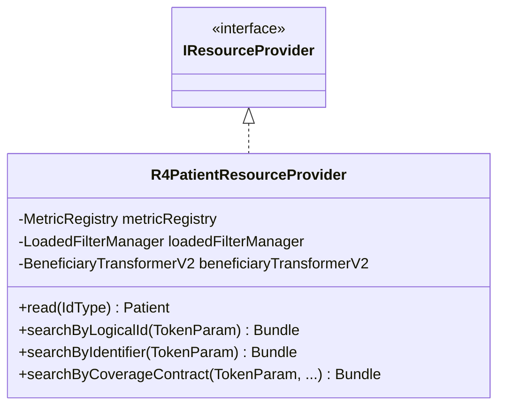
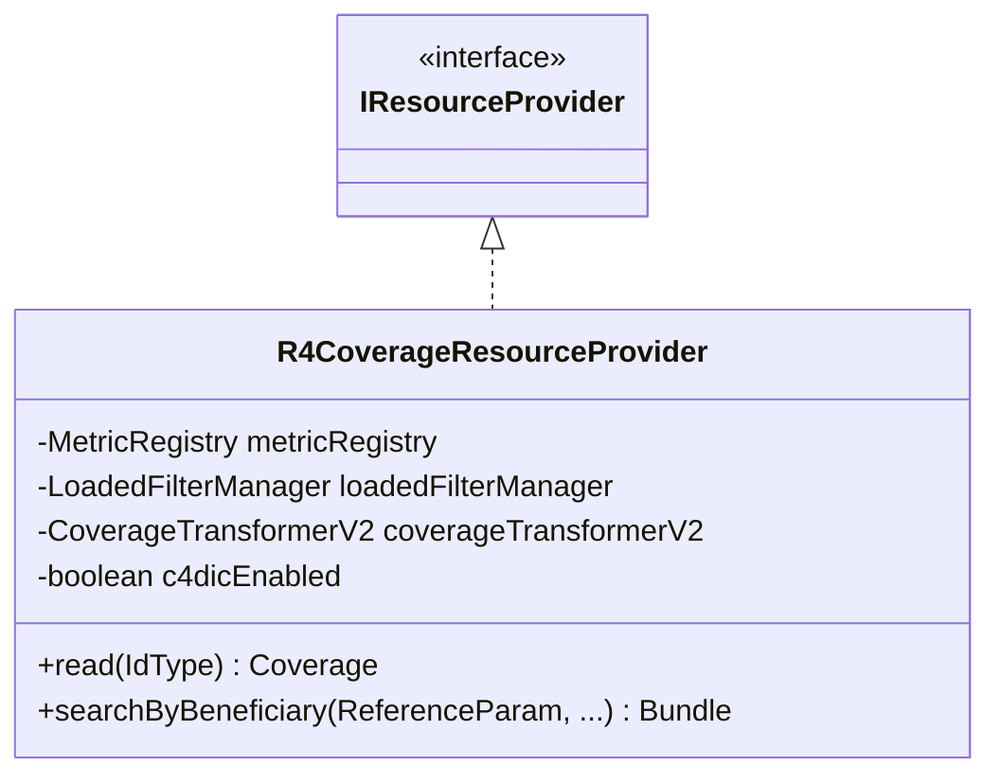
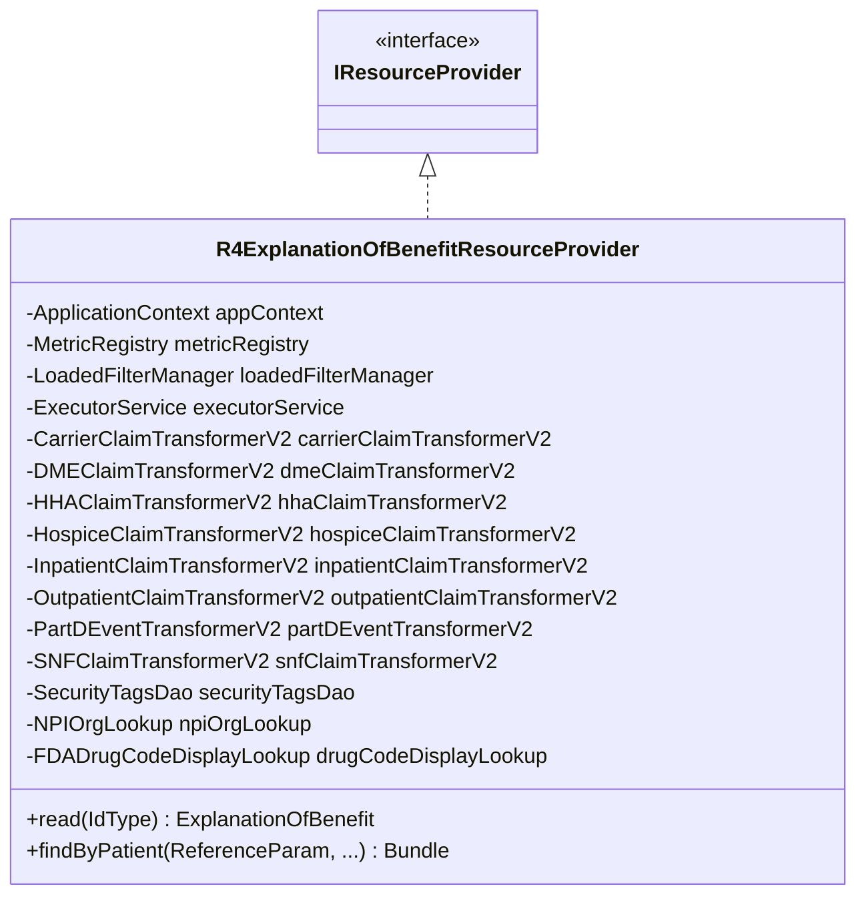
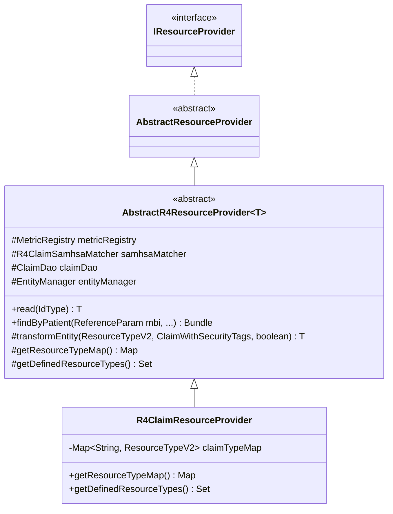
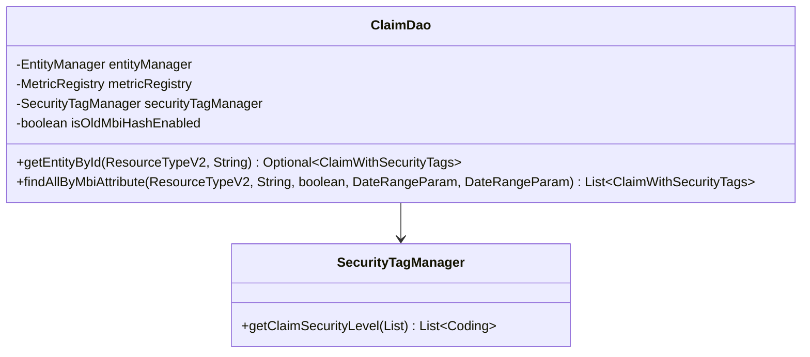
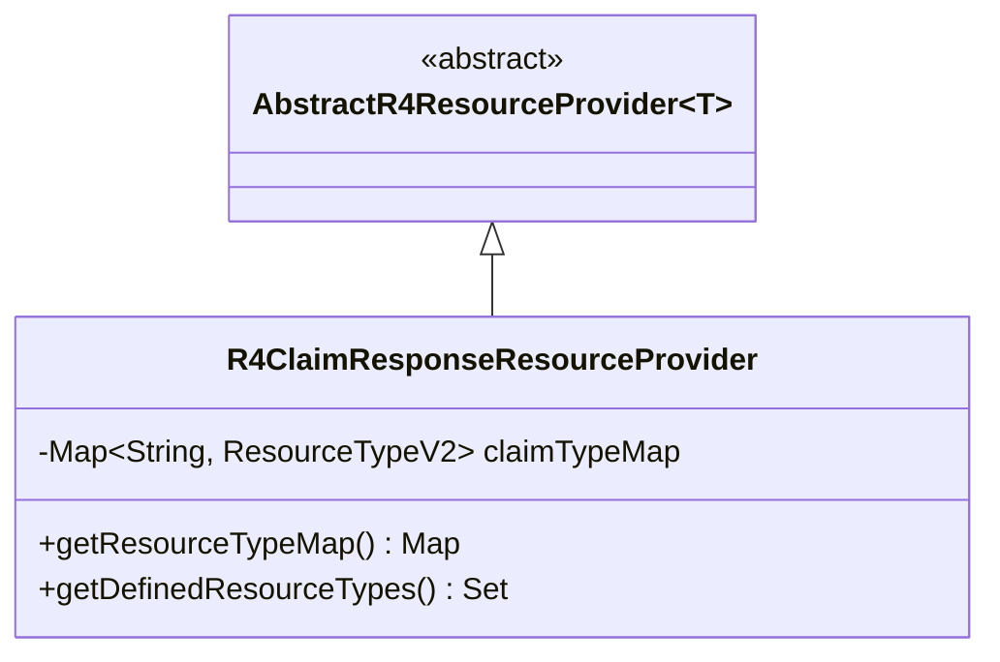
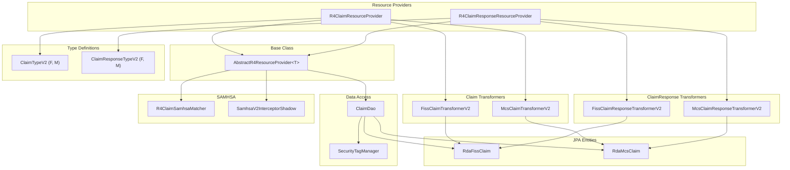

# BFD Codebase Analysis — R4 Resource Providers

> **Purpose:** Document the architecture, data models, transformation pipelines, and FHIR profile conformance of the five R4 resource providers relevant to PAS (Prior Authorization Support) integration.
>
> **Branch:** `feature/cms-0057f-pas-integration`
>
> **Source Root:** `apps/bfd-server/bfd-server-war/src/main/java/gov/cms/bfd/server/war/r4/providers/`

---

## Summary Table

| # | Resource Provider | FHIR Resource | Data Source | Transformer(s) | Profile(s) | Subsystem |
|---|---|---|---|---|---|---|
| 1 | `R4PatientResourceProvider` | `Patient` | CCW `Beneficiary` JPA entity | `BeneficiaryTransformerV2` | CARIN BB Patient, C4DIC Patient | Core |
| 2 | `R4CoverageResourceProvider` | `Coverage` | CCW `Beneficiary` enrollment data | `CoverageTransformerV2` | C4BB Coverage, C4DIC Coverage | Core |
| 3 | `R4ExplanationOfBenefitResourceProvider` | `ExplanationOfBenefit` | 8 CCW claim-type JPA entities | 8 transformers (one per claim type) | CARIN BB EOB profiles | Core |
| 4 | `R4ClaimResourceProvider` | `Claim` | RDA `RdaFissClaim` / `RdaMcsClaim` | `FissClaimTransformerV2`, `McsClaimTransformerV2` | — | PAC |
| 5 | `R4ClaimResponseResourceProvider` | `ClaimResponse` | RDA `RdaFissClaim` / `RdaMcsClaim` | `FissClaimResponseTransformerV2`, `McsClaimResponseTransformerV2` | — | PAC |

---

## Infrastructure Overview

| Aspect | Detail |
|---|---|
| **Build System** | Maven — parent POM at `apps/bfd-server/pom.xml`, artifactId `bfd-server-parent`, version `2.243.0-SNAPSHOT` |
| **HAPI FHIR Version** | Controlled by `${hapi-fhir.version}` property (defined in root parent POM) |
| **Deployment** | Spring Boot WAR (`bfd-server-war`) with HAPI FHIR resource providers |
| **Data Sources** | CCW (Chronic Conditions Warehouse) for core resources; RDA (Risk Data Adjustment) for PAC resources |
| **Model Artifacts** | `bfd-model-rif` (CCW entities), `bfd-model-rda` (RDA entities) |
| **Database** | PostgreSQL accessed via JPA / Hibernate |
| **Metrics** | Dropwizard `MetricRegistry` used across all providers and transformers |

---

## 1. R4PatientResourceProvider

**File:** `r4/providers/R4PatientResourceProvider.java` (1216 lines)

### 1.1 Class Hierarchy



### 1.2 Data Model

The `R4PatientResourceProvider` operates on the **`Beneficiary`** JPA entity sourced from the CCW database.

| Entity Field | FHIR Mapping | Notes |
|---|---|---|
| `beneficiaryId` | `Patient.id` | Primary identifier (numeric) |
| `medicareBeneficiaryId` | `Patient.identifier` (MBI system) | Unhashed Medicare Beneficiary Identifier |
| `nameGiven`, `nameSurname` | `Patient.name` | `HumanName.NameUse.USUAL` |
| `birthDate` | `Patient.birthDate` | — |
| `sex` | `Patient.gender` | Mapped via `Sex` enum → `AdministrativeGender` |
| `stateCode`, `postalCode` | `Patient.address` | Conditional on `includeAddressFields` header |
| `beneficiaryDateOfDeath` | `Patient.deceased[x]` | `DateTimeType` if present, `BooleanType(false)` otherwise |
| `race` | `Patient.extension` (US Core Race) | Mapped via `RaceCategory`, all codes treated as Unknown (UNK) in V2 |
| `beneficiaryHistories` | `Patient.identifier` (historic MBI extension) | From `BeneficiaryHistory` join table |
| Dual eligibility codes (Jan–Dec) | `Patient.extension` (monthly) | 12 monthly `CcwCodebookVariable.DUAL_*` extensions |

### 1.3 Transformation Pipeline

**Transformer:** `BeneficiaryTransformerV2` (`r4/providers/BeneficiaryTransformerV2.java`, 392 lines)

```
Beneficiary (JPA entity)
  │
  ▼
BeneficiaryTransformerV2.transform(beneficiary, requestHeader, addHistoricalMbiExtensions)
  │
  ├─ Set meta profile (C4BB Patient and/or C4DIC Patient)
  ├─ Map BENE_ID → Patient.identifier (MB type)
  ├─ Map unhashed MBI → Patient.identifier (MC type, with period)
  ├─ Map demographics: name, birthDate, gender, sex extension (US Core)
  ├─ Map address (state, postal code; full address conditional on header)
  ├─ Map deceased[x] (dateTime or boolean)
  ├─ Map race (CCW codebook + US Core OMB extension)
  ├─ Map historical MBIs (from BeneficiaryHistory, if enabled)
  ├─ Map Medicaid dual eligibility (12 monthly extension codes)
  └─ Set lastUpdated
  │
  ▼
Patient (FHIR R4)
```

**Constructor dependencies:**
- `MetricRegistry` — performance metrics
- `c4dicEnabled` (boolean, from `SSM_PATH_C4DIC_ENABLED`) — controls C4DIC profile inclusion

### 1.4 Search Parameters

| Operation | FHIR Method | Parameters | Database Query |
|---|---|---|---|
| Read | `@Read` | `IdType theId` | `CommonQueries.findBeneficiary()` by logical ID |
| Search by ID | `@Search` | `TokenParam _id` | Same as read |
| Search by Identifier | `@Search` | `TokenParam identifier` | By MBI hash, HICN hash, or unhashed MBI |
| Search by Coverage Contract | `@Search` | `TokenParam coverageId`, `ReferenceParam beneficiary`, `DateParam cursor` | Part D contract + year/month filtering |

**Supported identifier systems:**
- `CODING_BBAPI_BENE_MBI_HASH`
- `CODING_BBAPI_BENE_HICN_HASH`
- `CODING_BBAPI_BENE_HICN_HASH_OLD`
- `CODING_BBAPI_MEDICARE_BENEFICIARY_ID_UNHASHED`

**Custom headers:**
- `IncludeIdentifiers` — values: `"true"`, `"false"`, `"mbi"`
- `IncludeAddressFields` — controls whether full address is returned

### 1.5 FHIR Profile Conformance

- **CARIN BB Patient** — `Profile.C4BB.getVersionedPatientUrl()`
- **C4DIC Patient** — `Profile.C4DIC.getVersionedPatientUrl()` (conditionally enabled via SSM parameter)

Both profiles are added to `Patient.meta.profile` when enabled.

---

## 2. R4CoverageResourceProvider

**File:** `r4/providers/R4CoverageResourceProvider.java` (361 lines)

### 2.1 Class Hierarchy



### 2.2 Data Model

The `R4CoverageResourceProvider` derives `Coverage` resources from **`Beneficiary`** enrollment data. A single beneficiary produces up to **4 Coverage resources** (one per Medicare segment).

| Medicare Segment | Coverage Class | Key Entity Fields |
|---|---|---|
| **Part A** (Hospital Insurance) | `COVERAGE_PLAN_PART_A` | `partACoverageStartDate`, `partACoverageEndDate`, `partATerminationCode`, entitlement codes |
| **Part B** (Medical Insurance) | `COVERAGE_PLAN_PART_B` | `partBCoverageStartDate`, `partBCoverageEndDate`, `partBTerminationCode` |
| **Part C** (Medicare Advantage) | `COVERAGE_PLAN_PART_C` | Monthly contract numbers, PBP numbers, plan types, HMO indicators |
| **Part D** (Prescription Drug) | `COVERAGE_PLAN_PART_D` | `partDCoverageStartDate`, `partDCoverageEndDate`, monthly contract/PBP/segment numbers |

### 2.3 Transformation Pipeline

**Transformer:** `CoverageTransformerV2` (`r4/providers/CoverageTransformerV2.java`, 1352 lines)

```
Beneficiary (JPA entity) + MedicareSegment enum
  │
  ▼
CoverageTransformerV2.transform(medicareSegment, beneficiary, profile)
  │
  ├─ Switch on MedicareSegment:
  │   ├─ PART_A → transformPartA()
  │   ├─ PART_B → transformPartB()
  │   ├─ PART_C → transformPartC()
  │   └─ PART_D → transformPartD()
  │
  ├─ Each method:
  │   ├─ Set meta profile (C4BB or C4DIC)
  │   ├─ Set coverage ID (segment-specific)
  │   ├─ Set period (start/end dates)
  │   ├─ Set subscriber (MBI)
  │   ├─ Set type, relationship (SELF)
  │   ├─ Set beneficiary reference
  │   ├─ Set payor (CMS for C4BB; Organization with contact for C4DIC)
  │   ├─ Add coverage classes (GROUP, PLAN)
  │   ├─ Add extensions (enrollment status, entitlement codes, dual eligibility)
  │   └─ Set lastUpdated
  │
  ▼
Coverage (FHIR R4)
```

**Coverage ID patterns:**
- C4BB: `(\\p{Alnum}+-?\\p{Alnum})-(-?\\p{Digit}+)` — e.g., `{beneId}-{segmentId}`
- C4DIC: `(\\p{Alnum}+-?\\p{Alnum}+-?\\p{Alnum})-(-?\\p{Digit}+)` — includes profile discriminator

### 2.4 Search Parameters

| Operation | FHIR Method | Parameters | Notes |
|---|---|---|---|
| Read | `@Read` | `IdType theId` | Parses coverage ID to extract beneficiary ID and segment |
| Search by Beneficiary | `@Search` | `ReferenceParam beneficiary`, optional `TokenParam _profile` | Returns up to 4 Coverage resources; profile param selects C4BB or C4DIC |

### 2.5 FHIR Profile Conformance

- **C4BB Coverage** — `Profile.C4BB.getVersionedCoverageUrl()`
- **C4DIC Coverage** — `Profile.C4DIC.getVersionedCoverageUrl()` (conditionally enabled)

C4DIC profile adds:
- Color palette extension (foreground, background, highlight)
- Additional card information annotation
- Logo extension
- Organization payor with phone/TTY/website contacts

---

## 3. R4ExplanationOfBenefitResourceProvider

**File:** `r4/providers/R4ExplanationOfBenefitResourceProvider.java` (609 lines)

### 3.1 Class Hierarchy



### 3.2 Data Model — 8 Claim Types

The EOB provider aggregates data from **8 distinct CCW claim type entities**, each with its own JPA entity class:

| ClaimType Enum | JPA Entity | Description | SAMHSA Tag |
|---|---|---|---|
| `CARRIER` | `CarrierClaim` | Professional (physician) claims | `CarrierTag` |
| `DME` | `DMEClaim` | Durable Medical Equipment claims | `DmeTag` |
| `HHA` | `HHAClaim` | Home Health Agency claims | `HhaTag` |
| `HOSPICE` | `HospiceClaim` | Hospice care claims | `HospiceTag` |
| `INPATIENT` | `InpatientClaim` | Inpatient hospital claims | `InpatientTag` |
| `OUTPATIENT` | `OutpatientClaim` | Outpatient hospital claims | `OutpatientTag` |
| `PDE` | `PartDEvent` | Part D prescription drug events | `null` (no SAMHSA) |
| `SNF` | `SNFClaim` | Skilled Nursing Facility claims | `SnfTag` |

The `ClaimType` enum (`commons/ClaimType.java`) encapsulates entity class, ID attribute, beneficiary ID attribute, service date function, tag type, and lazy attributes for each type.

### 3.3 Parallel Query Architecture (ExecutorService Pattern)

The EOB provider uses a **parallel query architecture** to fetch and transform claims from all 8 claim types concurrently. This is the most complex data retrieval pattern in the BFD server.

```
findByPatient(beneficiaryId, claimTypes, ...)
  │
  ▼
┌─────────────────────────────────────────────────────────┐
│  For each ClaimType in claimsToProcess:                 │
│    1. Create PatientClaimsEobTaskTransformerV2 bean     │
│       (via appContext.getBean — each gets own           │
│        EntityManager for thread safety)                 │
│    2. Configure task with:                              │
│       - deriveTransformer(claimType) → transformer      │
│       - claimType, beneficiaryId, lastUpdated,          │
│         serviceDate, excludeSamhsa                      │
│    3. Add to callableTasks list                         │
└─────────────────────────────────────────────────────────┘
  │
  ▼
executorService.invokeAll(callableTasks)
  │
  ▼
┌─────────────────────────────────────────────────────────┐
│  Parallel execution across thread pool:                 │
│                                                         │
│  ┌──────────┐ ┌──────────┐ ┌──────────┐ ┌──────────┐  │
│  │ Carrier  │ │   DME    │ │   HHA    │ │ Hospice  │  │
│  │  Task    │ │  Task    │ │  Task    │ │  Task    │  │
│  └──────────┘ └──────────┘ └──────────┘ └──────────┘  │
│  ┌──────────┐ ┌──────────┐ ┌──────────┐ ┌──────────┐  │
│  │Inpatient │ │Outpatient│ │   PDE    │ │   SNF    │  │
│  │  Task    │ │  Task    │ │  Task    │ │  Task    │  │
│  └──────────┘ └──────────┘ └──────────┘ └──────────┘  │
└─────────────────────────────────────────────────────────┘
  │
  ▼
Collect Future results → Merge → Sort by (claimId, claimType) → Paginate → Bundle
```

**Key code reference** (lines 508–533):
```java
List<Callable<PatientClaimsEobTaskTransformerV2>> callableTasks =
    new ArrayList<>(claimsToProcess.size());

claimsToProcess.forEach(
    claimType -> {
      PatientClaimsEobTaskTransformerV2 task =
          appContext.getBean(PatientClaimsEobTaskTransformerV2.class);
      task.setupTaskParams(
          deriveTransformer(claimType),
          claimType, beneficiaryId, lastUpdated,
          serviceDate, excludeSamhsa);
      task.setIncludeTaxNumbers(includeTaxNumbers);
      callableTasks.add(task);
    });

List<Future<PatientClaimsEobTaskTransformerV2>> futures;
futures = executorService.invokeAll(callableTasks);
```

**Why `appContext.getBean()`:** Each task requires its own `EntityManager` instance since JPA `EntityManager` is not thread-safe. Spring's prototype-scoped bean ensures each task has an independent persistence context.

### 3.4 Transformer Derivation

The `deriveTransformer()` method (lines 586–607) maps `ClaimType` enum values to their corresponding transformer beans via a switch statement:

| ClaimType | Transformer Class |
|---|---|
| `CARRIER` | `CarrierClaimTransformerV2` |
| `DME` | `DMEClaimTransformerV2` |
| `HHA` | `HHAClaimTransformerV2` |
| `HOSPICE` | `HospiceClaimTransformerV2` |
| `INPATIENT` | `InpatientClaimTransformerV2` |
| `OUTPATIENT` | `OutpatientClaimTransformerV2` |
| `PDE` | `PartDEventTransformerV2` |
| `SNF` | `SNFClaimTransformerV2` |

### 3.5 Search Parameters

| Operation | FHIR Method | Parameters | Notes |
|---|---|---|---|
| Read | `@Read` | `IdType theId` | Returns single EOB |
| Search by Patient | `@Search` | `ReferenceParam patient`, optional `TokenAndListParam type`, `DateRangeParam _lastUpdated`, `DateRangeParam service-date`, `String excludeSAMHSA` | Parallel query across all claim types |

**Additional parameters:**
- `startIndex` / `_count` — pagination
- `includeTaxNumbers` — controls tax number inclusion in results

### 3.6 FHIR Profile Conformance

CARIN Blue Button (C4BB) ExplanationOfBenefit profiles are applied per claim type by each transformer. The EOB profiles include:
- C4BB EOB Inpatient Institutional
- C4BB EOB Outpatient Institutional
- C4BB EOB Professional NonClinician (Carrier)
- C4BB EOB Pharmacy (PDE)
- And similar profiles for DME, HHA, Hospice, SNF

---

## 4. R4ClaimResourceProvider (PAC Subsystem)

**File:** `r4/providers/pac/R4ClaimResourceProvider.java` (89 lines)

### 4.1 Class Hierarchy



### 4.2 Claim Type Map

The provider maps claim source types to `ClaimTypeV2` instances (lines 28–29):

```java
private static final Map<String, ResourceTypeV2<Claim, ?>> claimTypeMap =
    ImmutableMap.of("fiss", ClaimTypeV2.F, "mcs", ClaimTypeV2.M);
```

| Key | ClaimTypeV2 | JPA Entity | ID Attribute | MBI Attribute | Service Date Attributes |
|---|---|---|---|---|---|
| `"fiss"` | `ClaimTypeV2.F` | `RdaFissClaim` | `claimId` | `mbiRecord` | `stmtCovFromDate`, `stmtCovToDate` |
| `"mcs"` | `ClaimTypeV2.M` | `RdaMcsClaim` | `idrClmHdIcn` | `mbiRecord` | `idrHdrFromDateOfSvc`, `idrHdrToDateOfSvc` |

### 4.3 Resource ID Pattern

The `AbstractR4ResourceProvider` (line 84) defines the claim ID pattern:

```java
private static final Pattern CLAIM_ID_PATTERN = Pattern.compile("^([fm])-(-?\\p{Alnum}+)$");
```

- **`f-{claimId}`** — FISS claims (e.g., `f-LTA0M2EyNWU2YjM0MmRmOTczY2YyYjU`)
- **`m-{idrClmHdIcn}`** — MCS claims (e.g., `m--00009127422efa`)

The prefix `f` or `m` is used to dispatch to the appropriate transformer.

### 4.4 Data Access Layer — ClaimDao

**File:** `r4/providers/pac/ClaimDao.java` (359 lines)

The `ClaimDao` provides JPA CriteriaBuilder-based queries against `RdaFissClaim` and `RdaMcsClaim` entities.



**Key methods:**

| Method | Purpose | Query Pattern |
|---|---|---|
| `getEntityById()` | Retrieve single claim by ID | CriteriaBuilder with ID predicate + security tag subquery |
| `findAllByMbiAttribute()` | Retrieve claims by MBI | CriteriaBuilder with MBI join predicate, optional `lastUpdated` and `serviceDate` range filters |

**MBI lookup:** Supports both current MBI hash and old MBI hash (configurable via `isOldMbiHashEnabled`). The MBI is resolved through a join on the `mbiRecord` attribute of the claim entity.

**Security tags:** Each query also retrieves associated security tags via `SecurityTagManager` to support SAMHSA filtering.

### 4.5 Transformation Pipeline — FissClaimTransformerV2

**File:** `r4/providers/pac/FissClaimTransformerV2.java` (612 lines)

```
RdaFissClaim (JPA entity) + securityTags
  │
  ▼
FissClaimTransformerV2.transformClaim(claimGroup, includeTaxNumbers, securityTags)
  │
  ├─ Set ID: "f-" + claimGroup.getClaimId()
  ├─ Set contained Patient (from claim's MBI/beneficiary data)
  ├─ Set contained Provider Organization
  ├─ Set identifier (DCN)
  ├─ Set status (ACTIVE)
  ├─ ⚠️  Set use: Claim.Use.CLAIM  ← CRITICAL: must change to PREAUTHORIZATION for PAS
  ├─ Set type (INSTITUTIONAL)
  ├─ Set subType (from claim frequency code)
  ├─ Set insurance (from payer data)
  ├─ Set diagnosis codes (ICD-9 vs ICD-10 based on ICD_9_CUTOFF_DATE = 2015-10-01)
  ├─ Set procedure codes
  ├─ Set line items (from revenue lines)
  ├─ Set billable period (statement coverage dates)
  ├─ Set facility (from claim data)
  ├─ Set provider reference
  ├─ Set patient reference ("#patient")
  ├─ Set meta.lastUpdated
  ├─ Set meta.security (SAMHSA tags, if samhsaV2Enabled)
  └─ Set extensions (various FISS-specific fields)
  │
  ▼
Claim (FHIR R4)
```

> ### ⚠️ Critical PAS Detail
>
> **File:** `FissClaimTransformerV2.java`, **Line 149**
>
> ```java
> claim.setUse(Claim.Use.CLAIM);
> ```
>
> This line hardcodes the `Claim.use` field to `CLAIM`. For PAS (Prior Authorization Support) integration per the HL7 Da Vinci PAS Implementation Guide, this field **must** be set to `Claim.Use.PREAUTHORIZATION` when the claim represents a prior authorization request.
>
> The same pattern exists in `McsClaimTransformerV2.java` at **line 146**.

### 4.6 Transformation Pipeline — McsClaimTransformerV2

**File:** `r4/providers/pac/McsClaimTransformerV2.java` (398 lines)

```
RdaMcsClaim (JPA entity) + securityTags
  │
  ▼
McsClaimTransformerV2.transformClaim(claimGroup, includeTaxNumbers, securityTags)
  │
  ├─ Set ID: "m-" + claimGroup.getIdrClmHdIcn()
  ├─ Set contained Patient (from claim's MBI/beneficiary data)
  ├─ Set identifier (ICN)
  ├─ Set status (mapped from IdrStatusCode; CANCELED_STATUS_CODES = ["r", "z", "9"])
  ├─ ⚠️  Set use: Claim.Use.CLAIM  ← CRITICAL: must change to PREAUTHORIZATION for PAS
  ├─ Set type (PROFESSIONAL)
  ├─ Set diagnosis codes (from header and detail records, ICD-9 vs ICD-10 via ICD type field)
  ├─ Set line items with modifiers and NDC details
  ├─ Set insurance
  ├─ Set patient reference ("#patient")
  ├─ Set meta.lastUpdated
  ├─ Set meta.security (SAMHSA tags, if samhsaV2Enabled)
  └─ Set extensions (MCS-specific fields)
  │
  ▼
Claim (FHIR R4)
```

### 4.7 SAMHSA Filtering

The PAC Claim provider integrates SAMHSA (Substance Abuse and Mental Health Services Administration) filtering per 42 CFR Part 2:

1. **`R4ClaimSamhsaMatcher`** — Injected into `AbstractR4ResourceProvider`; evaluates whether a claim contains SAMHSA-sensitive data
2. **`excludeSAMHSA` parameter** — When `true`, claims with SAMHSA data are excluded from search results
3. **`SamhsaV2InterceptorShadow`** — Shadow mode logging for SAMHSA v2 comparison
4. **Security tags** — Attached to claims via `SecurityTagManager`; propagated to `meta.security` when `samhsaV2Enabled`

### 4.8 Configuration

| SSM Parameter | Purpose |
|---|---|
| `SSM_PATH_PAC_CLAIM_SOURCE_TYPES` | Comma-separated list of enabled claim source types (e.g., `"fiss,mcs"`) |
| `SSM_PATH_SAMHSA_V2_ENABLED` | Enables SAMHSA v2 security tag propagation |

### 4.9 Search Parameters

Inherited from `AbstractR4ResourceProvider`:

| Operation | FHIR Method | Parameters | Notes |
|---|---|---|---|
| Read | `@Read` | `IdType theId` | Parses `f-{id}` or `m-{id}` pattern |
| Search by Patient (MBI) | `@Search` | `ReferenceParam mbi`, optional `TokenAndListParam type`, `String isHashed`, `String excludeSAMHSA`, `DateRangeParam _lastUpdated`, `DateRangeParam service-date`, `String includeTaxNumbers` | Queries via `ClaimDao.findAllByMbiAttribute()` |

**Search flow:**
1. Parse MBI from request
2. Determine if MBI is hashed (default: `true`)
3. Query `ClaimDao` for matching claims across FISS and/or MCS types
4. Apply SAMHSA filtering if requested
5. Transform entities to FHIR Claim resources
6. Sort by ID for stable pagination
7. Return paginated Bundle

---

## 5. R4ClaimResponseResourceProvider (PAC Subsystem)

**File:** `r4/providers/pac/R4ClaimResponseResourceProvider.java` (88 lines)

### 5.1 Class Hierarchy



The `R4ClaimResponseResourceProvider` shares the same `AbstractR4ResourceProvider` base class as `R4ClaimResourceProvider`, reusing the identical read/search/pagination infrastructure.

### 5.2 Claim Type Map

```java
private static final Map<String, ResourceTypeV2<ClaimResponse, ?>> claimTypeMap =
    ImmutableMap.of("fiss", ClaimResponseTypeV2.F, "mcs", ClaimResponseTypeV2.M);
```

| Key | ClaimResponseTypeV2 | JPA Entity | ID Attribute | Security Tag |
|---|---|---|---|---|
| `"fiss"` | `ClaimResponseTypeV2.F` | `RdaFissClaim` | `claimId` | `FissTag` |
| `"mcs"` | `ClaimResponseTypeV2.M` | `RdaMcsClaim` | `idrClmHdIcn` | `McsTag` |

Note: `ClaimResponseTypeV2` uses the **same JPA entities** (`RdaFissClaim`, `RdaMcsClaim`) as `ClaimTypeV2`, but produces `ClaimResponse` resources instead of `Claim` resources.

### 5.3 Transformation Pipeline — FissClaimResponseTransformerV2

**File:** `r4/providers/pac/FissClaimResponseTransformerV2.java` (230 lines)

```
RdaFissClaim (JPA entity) + securityTags
  │
  ▼
FissClaimResponseTransformerV2.transformClaim(claimGroup, securityTags)
  │
  ├─ Set ID: "f-" + claimGroup.getClaimId()
  ├─ Set contained Patient
  ├─ Set identifier (DCN)
  ├─ Set status (ACTIVE)
  ├─ Set outcome (mapped from currStatus via STATUS_TO_OUTCOME)
  ├─ Set type (INSTITUTIONAL)
  ├─ Set use (ClaimResponse.Use.CLAIM)
  ├─ Set insurer (CMS)
  ├─ Set patient reference ("#patient")
  ├─ Set request reference (Claim/f-{claimId})
  ├─ Set items with adjudication components (ACO_RED_RARC, ACO_RED_CARC, ACO_RED_CAGC)
  ├─ Set extensions (currStatus, receivedDate, currTranDate, groupCode)
  ├─ Set meta.lastUpdated
  ├─ Set meta.security (if samhsaV2Enabled)
  └─ Set created (current date)
  │
  ▼
ClaimResponse (FHIR R4)
```

**FISS Status → RemittanceOutcome mapping:**

| Status Code | Outcome |
|---|---|
| `' '`, `'a'` | QUEUED |
| `'d'`, `'p'`, `'r'`, `'u'` | COMPLETE |
| `'f'`, `'i'`, `'m'`, `'s'`, `'t'` | PARTIAL |
| Unknown | PARTIAL (default) |

### 5.4 Transformation Pipeline — McsClaimResponseTransformerV2

**File:** `r4/providers/pac/McsClaimResponseTransformerV2.java` (231 lines)

```
RdaMcsClaim (JPA entity) + securityTags
  │
  ▼
McsClaimResponseTransformerV2.transformClaim(claimGroup, securityTags)
  │
  ├─ Set ID: "m-" + claimGroup.getIdrClmHdIcn()
  ├─ Set contained Patient
  ├─ Set identifier (ICN)
  ├─ Set status (mapped from IdrStatusCode; "r"/"z"/"9" → CANCELLED, else ACTIVE)
  ├─ Set outcome (mapped from IdrStatusCode via OUTCOME_MAP)
  ├─ Set type (PROFESSIONAL)
  ├─ Set use (ClaimResponse.Use.CLAIM)
  ├─ Set insurer (CMS)
  ├─ Set patient reference ("#patient")
  ├─ Set request reference (Claim/m-{idrClmHdIcn})
  ├─ Set extensions (statusCode, claimReceiptDate, statusDate)
  ├─ Set meta.lastUpdated
  ├─ Set meta.security (if samhsaV2Enabled)
  └─ Set created (current date)
  │
  ▼
ClaimResponse (FHIR R4)
```

**MCS Status → ClaimResponseStatus mapping:**

| Status Code | Status |
|---|---|
| `"r"`, `"z"`, `"9"` | CANCELLED |
| `null` / all others | ACTIVE |

**MCS Status → RemittanceOutcome mapping:**

| Status Codes | Outcome |
|---|---|
| `"a"`, `"b"`, `"j"`, `"k"`, `"1"`, `"2"` | QUEUED |
| `"c"`, `"l"`, `"3"`, `"8"` | PARTIAL |
| `"d"`, `"e"`, `"f"`, `"g"`, `"m"`, `"n"`, `"p"`, `"q"`, `"r"`, `"u"`, `"v"`, `"w"`, `"x"`, `"y"`, `"z"`, `"4"`, `"5"`, `"9"` | COMPLETE |
| `null` / empty | QUEUED |
| Unknown | PARTIAL (default) |

### 5.5 Search Parameters

Identical to `R4ClaimResourceProvider` (inherited from `AbstractR4ResourceProvider`):

| Operation | Parameters |
|---|---|
| Read | `IdType theId` — parses `f-{id}` / `m-{id}` |
| Search by MBI | `mbi`, `type`, `isHashed`, `excludeSAMHSA`, `_lastUpdated`, `service-date`, `includeTaxNumbers` |

### 5.6 Relationship Between Claim and ClaimResponse

The `ClaimResponse.request` field creates a reference back to the corresponding `Claim` resource:

- FISS: `ClaimResponse.request = "Claim/f-{claimId}"`
- MCS: `ClaimResponse.request = "Claim/m-{idrClmHdIcn}"`

Both resources are derived from the **same underlying JPA entities** (`RdaFissClaim` / `RdaMcsClaim`) but represent different FHIR views:
- **Claim** — the submitted claim itself
- **ClaimResponse** — the adjudication outcome (with status, outcome, and adjudication details)

---

## Appendix A: PAC Subsystem Component Map



---

## Appendix B: Critical Fields for PAS Integration

The following fields are hardcoded to `CLAIM` and must be evaluated for PAS support:

| File | Line | Current Value | Required for PAS |
|---|---|---|---|
| `FissClaimTransformerV2.java` | 149 | `claim.setUse(Claim.Use.CLAIM)` | `Claim.Use.PREAUTHORIZATION` |
| `McsClaimTransformerV2.java` | 146 | `claim.setUse(Claim.Use.CLAIM)` | `Claim.Use.PREAUTHORIZATION` |
| `FissClaimResponseTransformerV2.java` | 132 | `claim.setUse(ClaimResponse.Use.CLAIM)` | `ClaimResponse.Use.PREAUTHORIZATION` |
| `McsClaimResponseTransformerV2.java` | 149 | `claim.setUse(ClaimResponse.Use.CLAIM)` | `ClaimResponse.Use.PREAUTHORIZATION` |

Per the HL7 Da Vinci PAS Implementation Guide, the `Claim.use` element distinguishes a standard claim submission (`CLAIM`) from a prior authorization request (`PREAUTHORIZATION`). This is the single most critical field change required for PAS integration.
